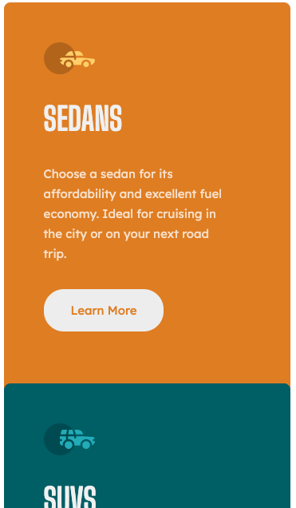
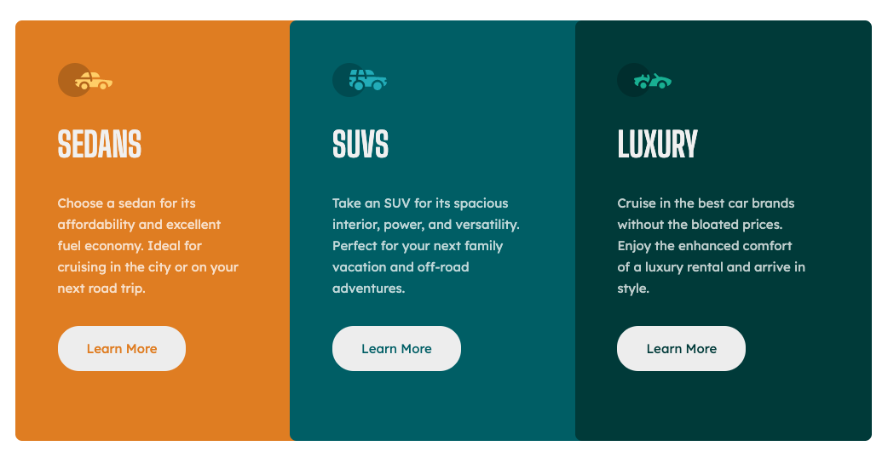

# Frontend Mentor - 3-column preview card component solution

This is a solution to the [3-column preview card component challenge on Frontend Mentor](https://www.frontendmentor.io/challenges/3column-preview-card-component-pH92eAR2-). Frontend Mentor challenges help you improve your coding skills by building realistic projects.

## Table of contents

- [Overview](#overview)
  - [The challenge](#the-challenge)
  - [Screenshot](#screenshot)
  - [Links](#links)
- [My process](#my-process)
  - [Built with](#built-with)
  - [What I learned](#what-i-learned)
  - [Continued development](#continued-development)
- [Author](#author)

## Overview

### The challenge

Users should be able to:

- View the optimal layout depending on their device's screen size
- See hover states for interactive elements

### Screenshot

### Links

- Solution URL: [Frontend Mentor solution](https://www.frontendmentor.io/solutions/responsive-mobile-first-3-column-preview-card-component-avfJnCr3_-)
- Live Site URL: [Deployed with Netlify](https://ubiquitous-twilight-7eb1e4.netlify.app/)

## My process

### Built with

- Semantic HTML5 markup
- Sass
- Flexbox
- Mobile-first workflow

### What I learned

I completed this (including downloading starter files etc) in under an hour - this was a practice to see if my time estimations were correct. I estimated 1.5 hours, which it will be with deploy and submission to frontent mentor and adding to my personal website etc.

### Continued development

This would be fun to build in react without the hardcoded text and work with an api or car data etc.

## Author

- LinkedIn - [Layne Taylor](https://www.linkedin.com/in/layne-taylor/)
- Frontend Mentor - [@laynet](https://www.frontendmentor.io/profile/laynet)
- Twitter - [@laynerzzzz](https://www.twitter.com/laynerzzzz)
